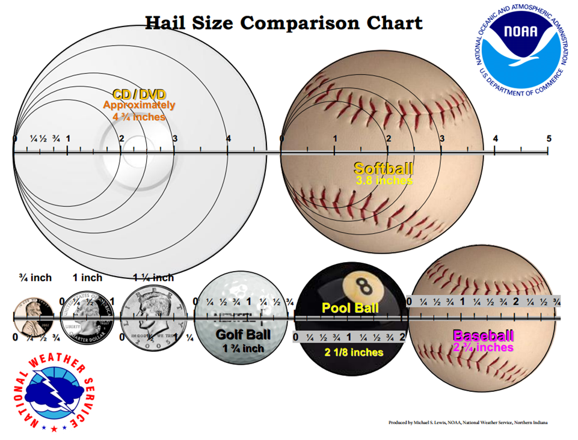

# How to Report Severe Weather to the National Weather Service

Once you’ve witnessed severe weather, **how you report it matters just as much as what you report**. Your report needs to be **timely, accurate, and clear** — and sent to the right people.

This guide walks you through the best methods to report severe weather safely and effectively.

---

## Where to Send Your Report

Choose one of the following **official NWS-approved methods**:

### 1. **Call Your Local NWS Office**
- Most reliable method for critical reports like tornadoes or damage
- Numbers are listed in the [Georgia NWS Contact Guide](./georgia-specific.md)

Best for: **Tornadoes, large hail, wind damage, flooding**

---

### 2. **Use the mPING App**
- Free app for iOS and Android  
- Sends your report (anonymously) to the NWS in real-time
- Simple categories like “hail,” “flood,” “tornado”

[Download mPING](https://mping.nssl.noaa.gov/)

Best for: **Quick hail, rain, or snow reports**

---

### 3. **Submit Online (Some NWS Offices)**
- Some offices have web-based spotter forms
- See [Georgia NWS Offices](./georgia-specific.md) for links

Best for: **Non-urgent reports or post-storm damage**

---

### 4. **Tag Your Local NWS on Twitter/X**
- Example: `@NWSAtlanta`
- Include time, location, and type of report
- Attach photos if safe and possible

Best for: **Real-time sharing with public and meteorologists**

---

## What to Include in Every Report

A great report is:

- **Exact**: Include time and location (GPS or city/street name)
- **Measured**: Use estimates only when you must (e.g., “quarter-size hail”)
- **Objective**: Avoid exaggeration — just the facts
- **Efficient**: Keep it to 1–2 sentences

## Format Example
```text
"1.25” hail in Rome, GA at 3:42 PM. Ground covered. Reported by trained spotter." Optional: Report from trained spotter
```


## When NOT To Report 

Don't send a report if:
- You're only seeing radar on an app or watching TV coverage
- You aren't sure what you are looking at (scud, wall cloud, etc.)
- You cannot report safely. NEVER prioritize a photo or video over your personal safety.

